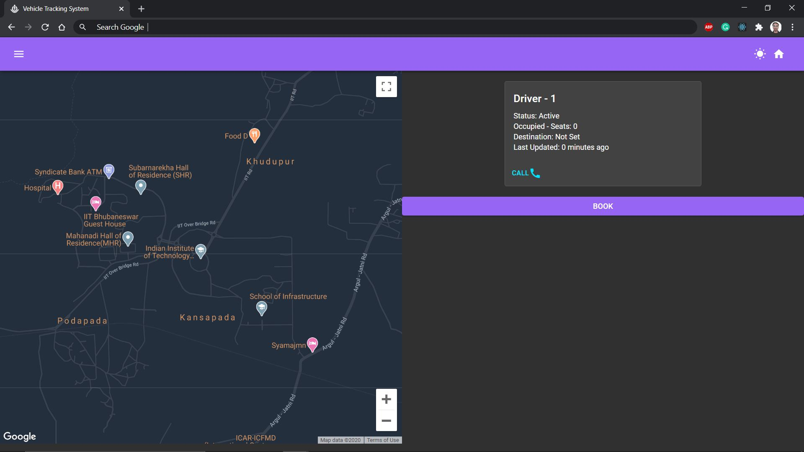
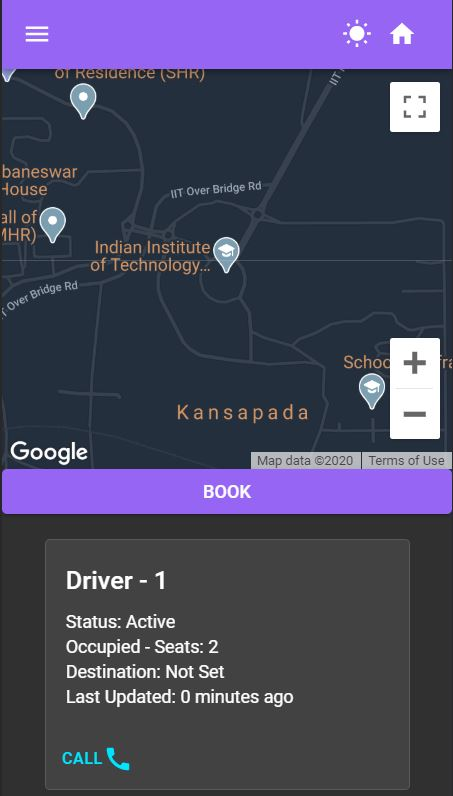
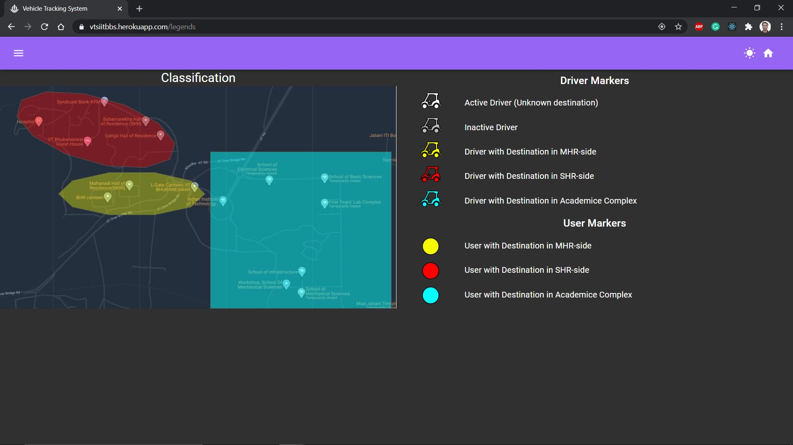
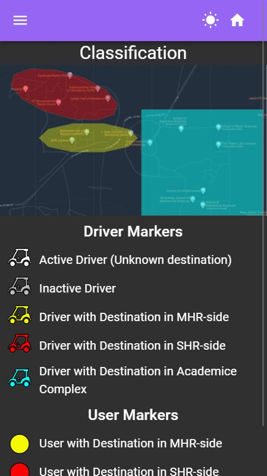
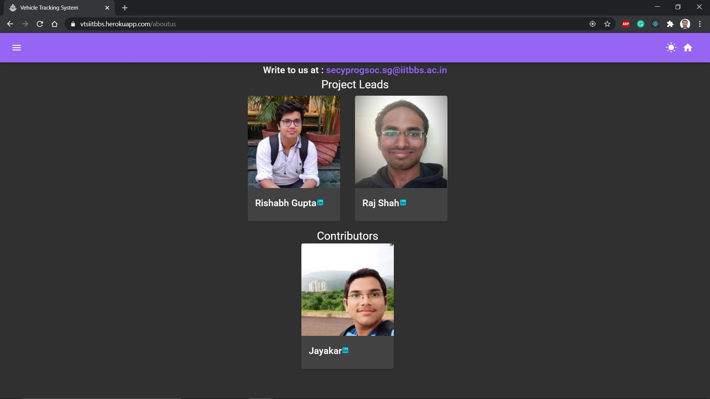
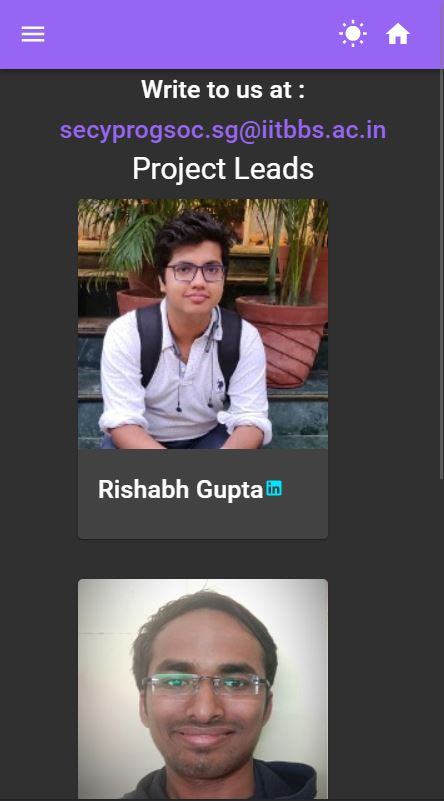
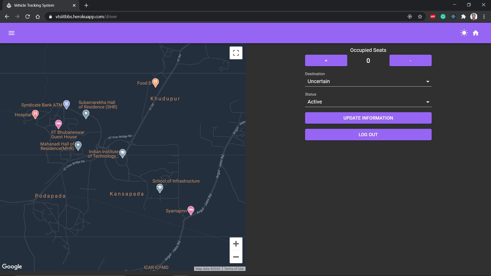
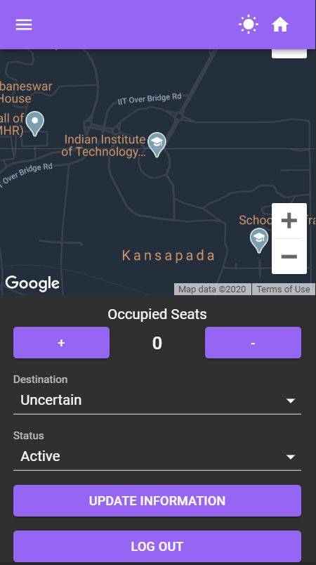

# Vehicle Tracking System Frontend:

web-app providing a communication medium for the students of IIT Bhubaneswar and BOV (Battery Operated Vehicle) drivers. 
> Hosted on https://vtsiitbbs.herokuapp.com  
> Backend Repository: https://github.com/NeuromancersIITBBS/VehicleTrackingSystem_Backend

## Table of Contents

- [Pages](#pages)
- [Features](#features)
- [Built Using](#built-using)
- [Contribution Guide](#contribution-guide)
- [Contributors](#contributors)
- [Contact Us](#contact-us)
- [create-react-app Scripts](#create-react-app-scripts)

## Pages

### User-Page

The user page consists of google-map, user-panel (displaying drivers' information), and book/unbook buttons.

Components used: BookModal, Map, UserPanel.

All the active drivers are shown in the user-panel. The drivers who have communicated to the backend at least once in the last 30 minutes are considered active. 
On this page, the user can request for a BOV (Battery-Operated-Vehicle) by pressing the BOOK button. This action will prompt the user to fill the destination and pickup-point. Pickup-point can be a building or user's current location. In the latter case, the user needs to allow location access to the web-app. 

After a successful book request, the user will receive a token from the backend, confirming the book request, and a marker corresponding to the user's destination (marker assignment is mentioned in the Legends page) will be placed **near** the pickup-point. The token is valid for 20 minutes, and it is stored in the local storage. So, this token is retained even after refreshing the page. When a token is available, BOOK button will be replaced by UNBOOK and GOTIN buttons. Pressing either of these buttons will remove the user from the map and delete the token. 

After 20 minutes, the token will be deleted from the local storage, and if the user is still online and the web-app is active, then the user's marker will be removed from the map. Otherwise, the backend will automatically remove the user marker from the map after 20-40 minutes of the book request.

Areas of Improvement: 
1. Find a better approach to show multiple users waiting on the same pickup-point
2. Cache map files using service-worker (if possible)
3. Lazy load book-modal

### Legends Page

Legends page shows how different destinations are classified in the Academic-Complex zone, the MHR-side zone, and the SHR-side zone. 

Components used: -

Areas of Improvement: 
1. Better image for zone classification

### About Us Page

The AboutUs page displays information about the contributors and the project-leads. Also, a mail-id is provided for communication.

Components used: AboutUsContent (UI)

Areas of Improvement: 
1. Refactoring (Move the code in AboutUsContent to AboutUs page and make profileDisplayCard component to make the code DRY.)

### Driver Page

The driver page is very similar to the user page. It contains google-map, user-panel, and driver login modal.

Components used: Map, DriverLogin, DriverPanel.

When no driver has logged in(i.e., no driver access token is stored in the local storage), this page will prompt a login/register modal. After a new driver registers, the admin needs to manually verify that driver (contact Secretary-Neuromancers for new registrations). After a successful login, the driver will be able to access the driver controls, and the front-end will receive an access token valid for 3 hours. The access token is stored in local storage, and it is required in every subsequent communication with the backend on driver page.

The driver also needs to give location access after logging in. In case the driver denies location access, this page will prevent him from updating his data. After successfully getting the location permission, the driver login modal will register the driver on the backend with location data. All the connected devices are informed to add a new driver on the map.

The driver-panel updates driver's location after every 3 minutes (Duration can be changed by changing the value of `DRIVER_LOCATION_UPDATE_INTERVAL` in /src/Data/Constants.js). The driver can also modify the number of occupied seats, status, and destination from the driver-panel. The marker of the driver depends on the status and destination. The driver can also log out using the LOG OUT button on the driver-panel. This button will inform the backend to remove the driver, and it will also delete the access token from the local storage. The access token is deleted automatically after 3 hours. (Note: Drivers must not share the access token) 

Areas of Improvement: 
1. Make navigation bar accessible when the driver login modal is open
2. Relocate log out button for better accessibility
3. Find a way to invalidate the access token after driver logs out

---

## Features
- JWT Authentication for users and drivers
- Responsive Layout created using Material-UI
- Cache-first strategy results in faster loading and less data usage
- Google Authentication is employed for Admin authentication
- The dark mode is available!

---

## Built Using 
- React 16.13.1
- Redux 4.0.5
- Styling: Material UI 
- Programming Languages: JSX, JS
- Socket Communications: Socket.io
- Hosting: Heroku

---

## Contribution Guide

- Fork this repository and download the source code using the `git clone` command
- run npm install in the repository to download all the dependencies
- Create your branch and make changes in your branch (Keep your branch up to date)
- Make sure the service worker is unregistered in index.js (In development phase)
- Verify your changes thoroughly on the local machine
- Use Material-UI consistently in case you modify/add JSX code (For example use Typography component instead of tags like `
`, `<h1>`, `<h2>`)
- Maintain the existing folder structure
- Before making a pull request, install dev-dependencies, run eslint script (`npm run eslint` or `npm run eslint-fix`) and fix the errors if you get any
- Send a pull request with a message describing all the changes made

---

## Contributors

- Rishabh Gupta (Project Lead)
- Raj Shah 
- Jayakar Reddy

---

## Contact Us
You can put your queries to us at [secyprogsoc.sg@iitbbs.ac.in](mailto:secyprogsoc.sg@iitbbs.ac.in)

---

## create-react-app Scripts

Use `npm install` to install all the dependencies.

This project was bootstrapped with [Create React App](https://github.com/facebook/create-react-app).

### Available Scripts

In the project directory, you can run:

#### `npm start`

Runs the app in the development mode. 
Open [http://localhost:3000](http://localhost:3000) to view it in the browser.

The page will reload if you make edits. 
You will also see any lint errors in the console.

#### `npm run build`

Builds the app for production to the `build` folder. 
It correctly bundles React in production mode and optimizes the build for the best performance.

The build is minified and the filenames include the hashes. 
Your app is ready to be deployed!

See the section about [deployment](https://facebook.github.io/create-react-app/docs/deployment) for more information.
